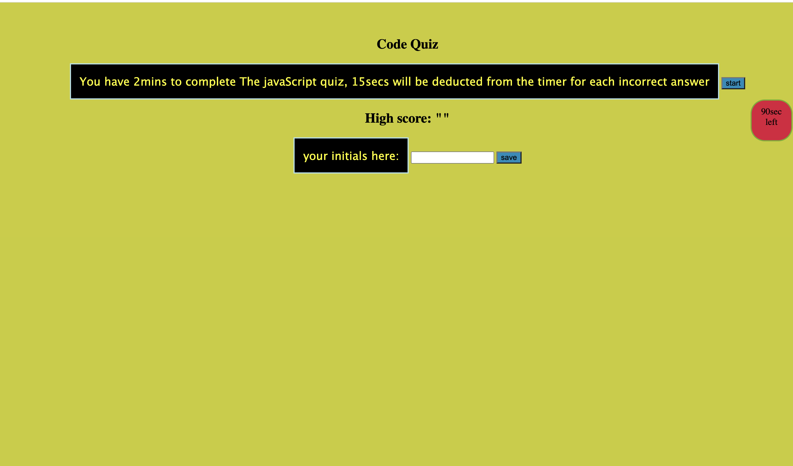

# Javascript-Code-Quiz-
# Introduction
    This Javascript code quiz requires javascript,CSS styling, and html skills. Dynamic elements were incorported to bring the quiz to life. The quiz also allowed for the use of the local storage property to retrieve and save high scores. 

# Description 
    The quiz was first constructed in html with div, buttons, and p tags. Next javascript was used to incorporate the multiple choice feature of the quiz. Formatting the multiple choice questions in an array with a counter variable in the first question function on lines 64 -71  allowed the questions to flow in sequential order. The classList property was used to traverse the "hidden" class list, this inabled the questions and answers to appear once the event listener was applied to the start button, since the first question function was called upon in line 60 with the startbtn and event listener. When retrieving and saving high scores, I used the local storage object to achieve these results as seen in js lines 122 to 128. The same quiz will be taken multiple times with various values so I for looped the high scores. Lastly I used a conditional statement to set the parameters of what will happen when a question is answered correctly or incorrectly. 

# Installation 
 Follow the url listed below to open the quiz in your browser:
[websitelink](https://rgonsahn.github.io/Javascript-Code-Quiz-/)

    See below for an example of the actual quiz:  
        